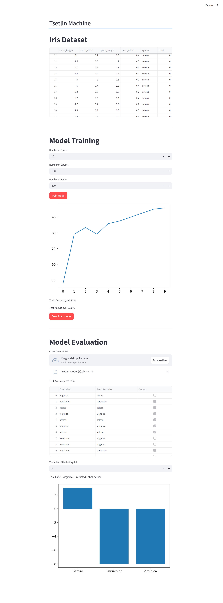

<!-- TOC start (generated with https://github.com/derlin/bitdowntoc) -->

- [Tsetlin Machine](#tsetlin-machine)
   * [Micropython (ESP32)](#micropython-esp32)
   * [Python (Windows / Linux / MacOS)](#python-windows-linux-macos)
      + [Prerequisites](#prerequisites)
      + [Irist Dataset](#irist-dataset)
      + [MNIST Dataset](#mnist-dataset)
      + [Optuna](#optuna)
      + [TMU](#tmu)
   * [Pytest](#pytest)
   * [Todo List](#todo-list)

<!-- TOC end -->

<!-- TOC --><a name="tsetlin-machine"></a>
# Tsetlin Machine

> Cross Platform Tsetlin Machine on the iris and mnist Dataset

| Hardware      | CPU                       | Memory | Speed        |
| ------------- | ------------------------- | ------ | ------------ |
| ESP32         | Xtensa LX6 @ 160MHz       | 520 KB | ~ 1.5 it/s   |
| Mango Pi MQ   | RISC-V 64 @ 1Ghz          | 64 MB  | ~ 60 it/s    |
| Orange Pi One | Allwinner H3 @ 1.296GHz   | 512 MB | ~ 800 it/s   |
| Google Pixelbook | Intel i5-7Y57 @ 3.30GHz| 8 GB   | ~ 8,000 it/s |
| Laptop PC     | Intel i5-1035G1 @ 3.60GHz | 16 GB  | ~ 8,000 it/s  |
| Desktop PC    | Intel i7-12700  @ 4.90GHz | 32 GB  | ~ 20,000 it/s |

<!-- TOC --><a name="micropython-esp32"></a>

## Micropython (ESP32)

Download micropython firmware [ESP32_GENERIC-20250911-v1.26.1.bin](https://micropython.org/resources/firmware/ESP32_GENERIC-20250911-v1.26.1.bin):

- https://micropython.org/download/ESP32_GENERIC/

Upload the firmware:

```
$ pip install esptool
$ esptooly erase-flash
$ esptool --baud 460800 write-flash 0x1000 ESP32_GENERIC-20250911-v1.26.1.bin
```

Install dependencies:

```
$ mpremote mip install argparse
```

Upload Python code to ESP32:

```
$ mpremote cp -r tsetlin :/tsetlin
$ mpremote cp iris.csv :/iris.csv
$ mpremote cp -r iris.py :/iris.py
$ mpremote cp -r main.py :/main.py
```

Reset and the model will start training:

```
(tsetlin.py) PS E:\tsetlin.py> mpremote
Connected to MicroPython at COM3
Use Ctrl-] or Ctrl-x to exit this shell

MPY: soft reboot
Using 4 bits for booleanization
Number of clauses: 20, Number of states: 10
Threshold T: 30, Specificity s: 6.0
[Epoch 1/10] Train Accuracy: 36.67%
[Epoch 2/10] Train Accuracy: 59.17%
[Epoch 3/10] Train Accuracy: 69.17%
[Epoch 4/10] Train Accuracy: 89.17%
[Epoch 5/10] Train Accuracy: 88.33%
[Epoch 6/10] Train Accuracy: 86.67%
[Epoch 7/10] Train Accuracy: 86.67%
[Epoch 8/10] Train Accuracy: 94.17%
[Epoch 9/10] Train Accuracy: 91.67%
[Epoch 10/10] Train Accuracy: 90.83%
```

<!-- TOC --><a name="python-windows-linux-macos"></a>
## Python (Windows / Linux / MacOS)

<!-- TOC --><a name="prerequisites"></a>
### Prerequisites

Using `pip`:

```
$ python -m pip install -r requirements.txt
```

Using `pipenv`:

```
$ python -m pip install pipenv

$ pipenv install
$ pipenv shell
```

Using `uv`

```
$ uv python install 3.12
$ uv venv --python 3.12
$ uv sync

# Linux
$ . .venv/bin/activate

# Windows
$ Set-ExecutionPolicy Unrestricted -Scope Process
$ .venv\Scripts\activate

```

<!-- TOC --><a name="irist-dataset"></a>
### Irist Dataset

Train and save the model

```
$ python main.py
```

Using `streamlit` as the UI:

```
$ python main_ui.py
```



<!-- TOC --><a name="mnist-dataset"></a>
### MNIST Dataset

Using [TMU library](https://github.com/cair/tmu):

```
$ python main_tmu.py
```

```
$ python main_mnist.py
```

<!-- TOC --><a name="optuna"></a>
### Optuna

```
$ python main.py --optuna
```

```
$ optuna-dashboard sqlite:///db.sqlite3
```

<!-- TOC --><a name="tmu"></a>
### TMU

> [!NOTE]  
> For Windows users, Visual Studio (Microsoft C++ Build Tools) is needed to compile `TMU` package.

Using `pipenv`:

```
$ pipenv install git+https://github.com/cair/tmu.git
```

Using `uv`:

```
$ uv pip install git+https://github.com/cair/tmu.git
```

<!-- TOC --><a name="pytest"></a>
## Pytest

```
$ pytest
```

```
============================================= test session starts =============================================
platform win32 -- Python 3.10.18, pytest-8.4.2, pluggy-1.6.0
rootdir: C:\Users\Han\Desktop\tsetlin.py
collected 7 items                                                                                              

tests\test_automaton.py ....                                                                             [ 57%]
tests\test_booleanize.py .                                                                               [ 71%] 
tests\test_clause.py ..                                                                                  [100%]

============================================== 7 passed in 0.36s ============================================== 
```

<!-- TOC --><a name="todo-list"></a>
## Todo List

[●] Debug: Import / Save model  
[●] Debug: Print clause output & class sum  
<br/>
[●] MNIST Dataset  
[●] Interface for quick benchmark (T, s, confusion matrix)  
[●] Different booleanize methods  
<br/>
[●] TMU Library  
[●] Hyper-parameter (Optuna)  
<br/>
[●] [**UK DALE - Preprocessing**](./dataset/)  
[●] [**Online / Offline Data Simulator**](./dataset/simulator/)  
<br/>
[&nbsp; ] [NILM (FHMM / CO / KNN / SVM / DNN)](./model/)  
[&nbsp; ] **Unsupervised TM using ART**  
<br/>
[&nbsp; ] Improve: [Adaptive Reasonance](https://arxiv.org/pdf/1905.11437)  
[&nbsp; ] Improve: [Coelesed TM with Clause Sharing](https://arxiv.org/abs/2108.07594)  
